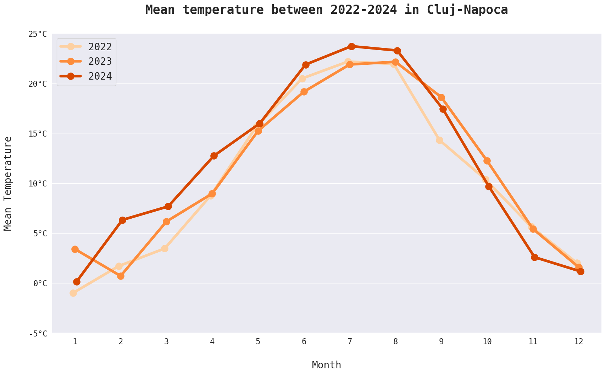
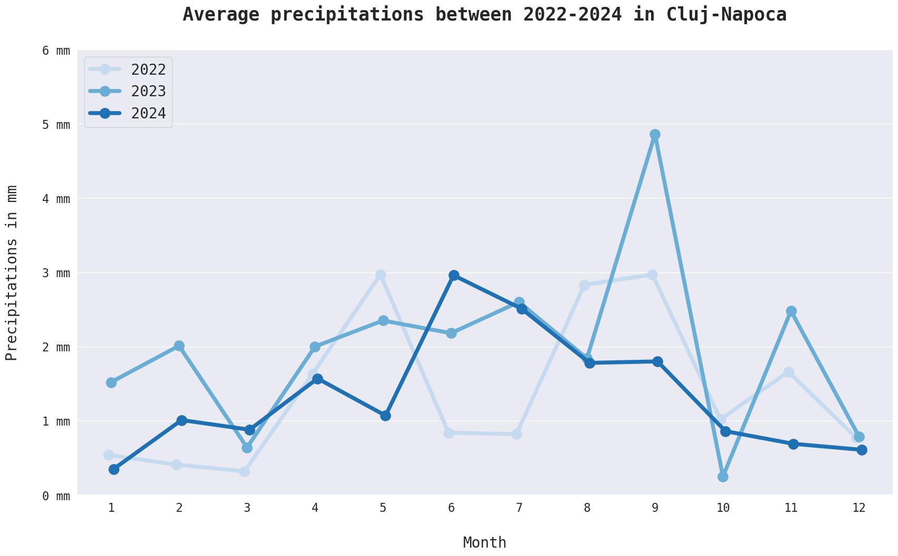
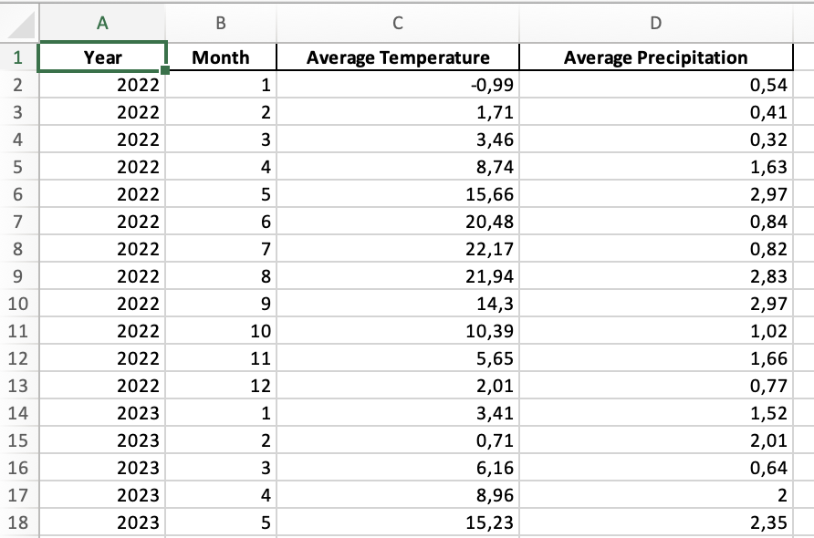

## Wheather Data Analysis with Python

Below are two graphs representing the average monthly <b>temperature</b> and <b>precipitation</b> for the years 2022-2024 in Cluj-Napoca

  
  

At the same time, the program also generated an Excel file. Below is a screenshot from this file.

